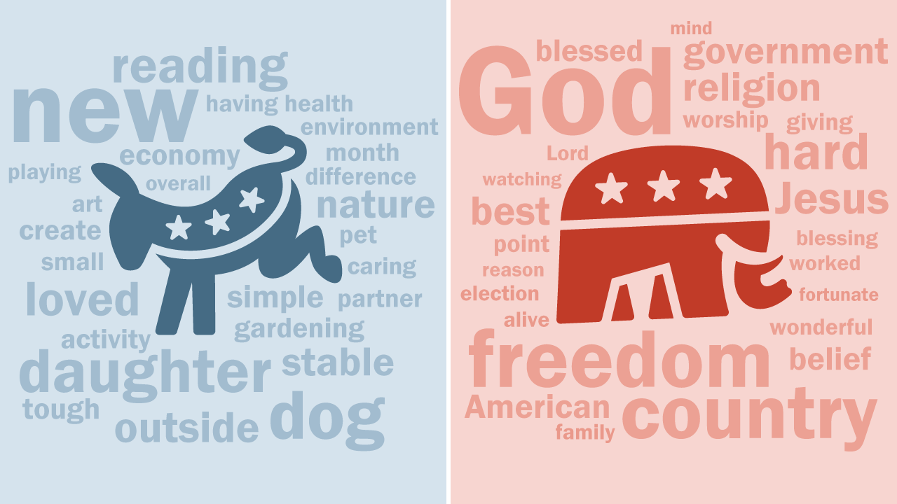
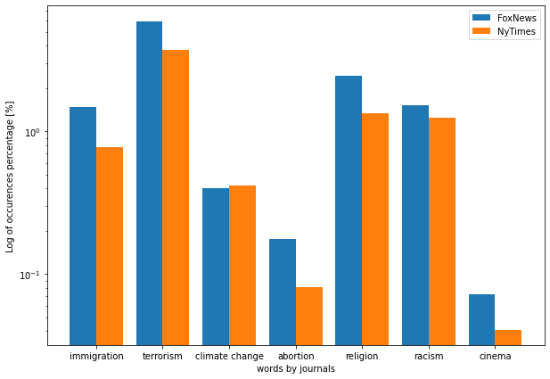

# Introduction

## Abstractiooooon

Donald Trump banned from twitter; this sentence should be familiar to you. In the last ten years, there has been an explosion of polemical phrases of all kinds. Most of the well-known newspapers have picked up these quotations and put them in their columns, and not only from Twitter... Thanks to the framework *Quobert*, developed by Robert West and others, we have a dataset of millions of quotations on hand coming from different newspapers between 2015 to 2020. The <b> million-dollar </b> question was the next one, what can we proceed with such a dataset?

To point out some interesting facts about these quotations, we have decided that we are going to focus on three main reading axes. Before doing this, the key step is <b> to read the entire dataset </b>. Once this has been done, we can then <b> much easily play with our data </b> ! Then, we decided to make <b> comparisons </b> between newspapers affiliated with <b> Democrats or Republicans </b>, and to see if there is an affiliation between the quotations reported in the newspapers and their political positioning. Since there are plenty of different newspaper, we decided <b> to focus initially on only two newspapers </b>, whose political views are well known. For doing comparisons between two newspapers, the objective is to analyze which <b> parameters </b> allow to make a difference between them. 

The three <b> parameters </b> we picked out are <b> topic detection, speakers, and sentiment analysis </b>. Once we analyze the quotations of two newspapers with those guidelines, the next step is apply the parameters whose give a signifcant results to other journals. That in order to produce a clear framework that would allow to compare newspapers and state their political affiliation.

# Methods

## Choice of the two reference newspapers

First, the choice of the two newspapers we will work with is crucial. Some journals have “centered” opinions or shaded positioning. That is why, the focus will be made on polarized newspapers, which will make it easier to study and define the parameters. For our study, two newspaper have been chosen: Foxnews and New York Times. Both are polarized, Foxnews is in favor of more conservative political positions and is mainly viewed by Republican partisans while New York Times is more left-leaning and followed mainly by Democrats (figure below, [Statista, consulted the 15.11.2021](https://www.statista.com/chart/21328/party-affiliation-by-news-source/)).

## Wrangling and reading the dataset

Concerning the reading of the data, our first approach was to read the dataset using chunks and then to generate a single pickle file from these chunks. The problem was that reading the chunks one after the other from the pickle file generated an extremely heavy file (the operation was stopped when the file size exceeded 150 Gigabytes!). 
Consequently, an alternative was proposed : the approach was to use only one chunk per pickle by reading the files of each year and combining them together. Then, we were able to generate a dataframe for each newspaper we were interested in, which whole quotations between 2015 and 2020.  

# What can be said about the number behind the quotations ?

## BLABLABLA

We selected some words that we thought they can differentiate democrats and republicans and we analyze their frequency of apparencies in the Quotebank. We notice that even though the number of quotations from the New York Times in the Quotebank dataset is larger than the one from Fox News <b> (mettre NUMBER !!!!!!!!!!!!!) </b>, the later has more quotations about those topics than the other one, except for climate change where their occurrences are similar. From this we can maybe elaborate a first hypothesis that Fox News gives a higher importance to sensitive topics. 

<body> 

 
<h3> Word normalization by stemming </h3>
   

   
 
</body> 

  

A t-test was done to search for a correlation between our results and as expected, only the p-value of topics related to climate change was higher than 0.05 <b> (ALPHA !!!!!!!!!!!!!) </b> and thus their means are comparable. This could be maybe explained by the fact that the New York Times has other priorities. 

# Example image

# Table example

<table style="width:100%">
  <tr>
    <th>Social Network</th>
    <th>Data</th>
  </tr>
  <tr>
    <td>Twitter</td>
    <td>3 millions of tweets from 4k users</td>
  </tr>
  <tr>
    <td>Stack Overflow</td>
    <td>1 million of comments from 22k of users</td>
  </tr>
  <tr>
    <td>Weibo</td>
    <td>40k posts from 431 users </td>
  </tr>
  <tr>
    <td>Reddit</td>
    <td>272k comments from french subreddit</td>
  </tr>
</table>

# HTML example

<html> 
  <head> 
     
     
  </head> 

  <body> 
  
 
  <h3> Comparison between the distribution of posts during the day across our platforms </h3>
     

     
 
  </body> 
</html>

# Retour à la ligne, exemple

Based on the graphs, some observations can be made:
<ul>
  <li><b>Usage drops across all platforms at night</b>, and increases in the morning.</li>
  <li>While for <b>Twitter and Weibo</b>, usage continues to increase during the day and lowers at night, starting at around 9pm, the trend seems to differ for Reddit and Stack Overflow. For these platforms, <b>the activity drops earlier</b>, at around 2pm for Reddit and 3pm for Stack Overflow.</li>
  <li>Stack Overflow is a work-oriented platform, these observations are in line with the usage we expect. The <b>users are mainly active during work hours (9pm-5am)</b>. We can even see little drops at lunch time. </li>
  <li>The same remark as the previous one can be made about Reddit even if it can be surprising considering that it is a social network that contains all kinds of contents. </li>
</ul>

# Table 2, example

<table style="width:100%">
<caption>Distribution of the posts/hour disregarding the day of the week
</caption>
  <tr>
    <th></th>
    <th>00-06am</th>
    <th>06-12am</th>
    <th>12am-06pm</th>
    <th>06-12pm</th>
  </tr>
  <tr>
    <td>Twitter</td>
    <td>15.2%</td>
    <td>19.2%</td>
    <td>28.3%</td>
    <td>37.3%</td>
  </tr>
  <tr>
    <td>Stack Overflow</td>
    <td>7.5%</td>
    <td>29.7%</td>
    <td>40.7%</td>
    <td>22.1%</td>
  </tr>  
  <tr>
  <td>Weibo</td>
  <td>9.3%</td>
  <td>23.1%</td>
  <td>32.2%</td>
  <td>35.4%</td>
</tr>
<tr>
  <td>Reddit</td>
  <td>6.7%</td>
  <td>28.9%</td>
  <td>39.5%</td>
  <td>24.9%</td>
</tr>

</table>

# HTML, Example 2

After having studied the activity related to the posts and comments, let's dive into the users' activity.

<html> 
  <head> 
     
     
  </head> 

  <body> 
  
 
  <h3> Comparison between the distribution of active users during the day across our platforms </h3>
     

     
 
  </body> 
</html>

The distribution of active users by time of day and day of the week <b>does not differ dramatically to the posts</b>. We can still note a few interesting observations. For Twitter the number of active users <b>does not increase as fast as the number of tweets during the day</b>. It seems that people tend to tweet more at the end of the day. For Stack OverFlow,<b> the peaks in number of comments correspond to the peak in active users</b>. Finally for Weibo, trends are very similar across both of the distributions.

# Conclusion

Bla Bla Bla

 
<footer style="background-color: #d32f2f">
    

        

            

                

                     
                    Mettler Marc, Gulart Maia Manuela, Msaada Sinda, Charroin François
                     
                    <button id="ada"><b>ADA</b></button>, EPFL, December 2021
                     
                    <a href="https://github.com/epfl-ada/ada-2021-project-therealabracadabra"><b>GitHub Repository</b></a>
                    •
                    <a href="https://github.com/mmettler21/political_analysis"> <b> Website Repository </b> </a>
                     
                    <b>Theme </b>
                    <a href="https://github.com/chibicode/duo">duo</a>
                    <b>by </b>
                    <a href="https://github.com/chibicode">Shu Uesugi</a>
                     
                

            

        

    

</footer>

<a href="https://github.com/epfl-ada/ada-2020-project-milestone-p3-p3_adatada" class="github-corner"><svg width="80" height="80" viewBox="0 0 250 250" style="fill:#151513; color:#fff; position: absolute; top: 0; border: 0; right: 0;">
        <path d="M0,0 L115,115 L130,115 L142,142 L250,250 L250,0 Z"></path>
        <path d="M128.3,109.0 C113.8,99.7 119.0,89.6 119.0,89.6 C122.0,82.7 120.5,78.6 120.5,78.6 C119.2,72.0 123.4,76.3 123.4,76.3 C127.3,80.9 125.5,87.3 125.5,87.3 C122.9,97.6 130.6,101.9 134.4,103.2" fill="currentColor"
            style="transform-origin: 130px 106px;" class="octo-arm"></path>
        <path
            d="M115.0,115.0 C114.9,115.1 118.7,116.5 119.8,115.4 L133.7,101.6 C136.9,99.2 139.9,98.4 142.2,98.6 C133.8,88.0 127.5,74.4 143.8,58.0 C148.5,53.4 154.0,51.2 159.7,51.0 C160.3,49.4 163.2,43.6 171.4,40.1 C171.4,40.1 176.1,42.5 178.8,56.2 C183.1,58.6 187.2,61.8 190.9,65.4 C194.5,69.0 197.7,73.2 200.1,77.6 C213.8,80.2 216.3,84.9 216.3,84.9 C212.7,93.1 206.9,96.0 205.4,96.6 C205.1,102.4 203.0,107.8 198.3,112.5 C181.9,128.9 168.3,122.5 157.7,114.1 C157.9,116.9 156.7,120.9 152.7,124.9 L141.0,136.5 C139.8,137.7 141.6,141.9 141.8,141.8 Z"
            fill="currentColor" class="octo-body"></path>
    </svg></a>

# Introduction:

## Abstract:

Facebook, Twitter, Linkedin, Pinterest, Stack Overflow, Snapchat, Weibo, Instagram, TikTok , if this list doesn't mean anything to you, you have probably been away for the last 10 years. Created for some over 15 years ago, or for others just a few years ago, <b>social networks have changed our lives</b>. Going on instagram liking the latest photo of your friends, reading posts and articles on Linkedin or spending your underground ride watching the latest reddit memes or trendy TikTok is the routine of some people.

We spend hours every day on social networks. If in <b>Switzerland we spend on average almost more than 1 hour per day</b> on social networks, which is already significant, this number remains low compared to other countries such as the<b> Philippines or Brazil, where people spend on average 4 hours and 3 hours 45 minutes per day respectively </b>on social networks.

In our data story, we are going to focus on the use that can be made of social networks, to understand how we <b>consume the different social networks</b>  and also to study the possible <b>differences between the networks</b>. 

<b>Do we use a work-oriented social network as much and in the same way as a social network focused on the exchange of information or a fun social network?</b> This is what we are going to answer.

## Methods

In our data story, we will focus on two major phenomena: <b>the distribution of the number of posts/comments per user and the use of networks according to a circadian rhythm.</b>

The first phenomenon allows us to study user engagement on a platform, how many users post content and in which quantity? In this first part we will also see if power users really exist, <b>power users</b> are users who publish and share a lot of information/posts/comments. It is often thought that a small percentage of users are responsible for most of the content on social networks <b>(20%-80% rule of content generation)</b>, we will see if this is true, and if so for all social networks.

The study of the second phenomenon will allow us to see if our use of social networks is linked to a certain rhythm. Are we going to use social networks on a certain day, at a certain time? We will also see if the <b>observations are common to all networks or if each social network has its own specificities.</b>

## Social networks studied

In our data story, we will use data from 4 social networks: <b>Twitter, Stack Overflow, Weibo and Reddit</b>. We will present these social networks and then we will look in more detail at the datasets we were able to use for each social network.

    

        

            
        

        

            

                <h2> Twitter </h2>
          Twitter is one of the oldest social networks, founded in 2006, it is based on interaction around tweets. Tweets are short texts of 140 characters. In 2020, Twitter has an average of 320 million monthly users. The users of this network are very active, each year nearly 200 billion tweets are published.
                Twitter is a generalist social network (news, humor, videos, blogging).
            

        

    

 

    

        

            

                <h2> Stack Overflow </h2>
                Stack Overflow is a social network founded in 2008 of questions and answers on a wide range of topics concerning computer programming. The site is very popular in the student and programmer community. Today, the site has more than 11 million registered users.
            

        

        

            
        

    

 

    

        

            
        

        

            

                <h2> Weibo</h2>
                Weibo is a Chinese social network founded in 2009 open only to people living in China. Not very popular in the West, it is often referred to as 'Chinese twitter' because it is close to this social network. It is a micro-blogging social network, which also has friend and profile features like Facebook. Weibo is very popular in China, with 523 million monthly users. Worldwide it is one of the biggest social networks.
            

        

    

 

    

        

            

                <h2> Reddit </h2>
                Reddit is an American social network founded in 2005. It is a very active social network with 330 million users.  Registered members submit content to the site such as links, text posts, and images, which are then voted up or down by other members. Posts are organized by subject into user-created boards called "subreddits", which cover a variety of topics such as news, politics, science, movies, video games, music, books, sports, fitness, cooking, pets, and image-sharing.
            

        

        

            
        

    

 

# Are you power users?

##  Data in numbers

<table style="width:100%">
  <tr>
    <th>Social Network</th>
    <th>Data</th>
  </tr>
  <tr>
    <td>Twitter</td>
    <td>15 millions of tweets from 34k users</td>
  </tr>
  <tr>
    <td>Stack Overflow</td>
    <td>76 millions of comments from 13 millions of users</td>
  </tr>
  <tr>
    <td>Weibo</td>
    <td>4,8 millions of posts from 1,1 millions of users</td>
  </tr>
  <tr>
    <td>Reddit</td>
    <td>6,3 millions of comments from 150k users</td>
  </tr>
</table>

##  Distribution of the number of posts according to users and platforms

Now let's take a look at how the users of these different social networks use them. <b>Did they really use it as a social interaction tool as it is suggested by the name? Or do people use it more as a "fast food" content consumption service?</b> In order to have a better idea of this, we can look at the distribution of the number of posts by user.

In these graphs we recognize that the <b>distribution of the number of posts/comments per user is a power law.</b> This observation is particularly true for the Stack Overflow data. On <b>Stack Overflow</b> we have a very representative set of data since we have all the data of the site since its creation, and we notice that <b>we can approximate the distribution by a straight line in log-log scale, a characteristic sign of power laws.</b>

As we can see, in most social networks, <b>about half of the people didn't share any content and the big majority of them only post a small amount of the content.</b> You probably recognize yourself in this remark, <b>many of us use some social networks in a passive way</b>. Using Stack Overflow just by looking at the answers to other questions, on twitter browse your feed without posting or look at the best reddit memes without posting any.  

<b>Most of the content is generated by a minority of users.</b> If we take the case of Twitter, <b>2% of users created 76% of tweets</b>, and <b>14.5% of them created 99% of posts.</b> We also found close results for Stack Overflow, <b>with 2% of users sharing 76% of the results and 18% of the created 99% of the posts. </b>
Now let's take a closer look at how this distribution behaves for Weibo. This distribution was created from a one-week time span. We can see that less than a tenth of the users post content each week.  In Weibo <b>2% of the users created 82% of the content, and 8% of the user created more than 99% of the post.</b> This further emphasizes the idea that the majority of content is created by a minority.

On the other hand, if we look amongst the active users (the users who have shared at least one post), <b>we see that Weibo seems to be the most participative social networks with 96% of users creating 99% of the content.</b> One the second place we found <b>Stack Overflow with 78% users creating 99% othe content.</b> For Reddit 60% of the users create 99% of the content and finally <b>for Twitter, only 26% of the active users create 99% of the content.</b>

Most of the social networks are mostly composed of a large invisible mass that is only there to consume the content and does not really create significant social interaction. But if we look amongst the active users, the results seem a bit more mixed and more users seem to be involved in the creation of content.<b> There is a great disparity between the different social networks.</b> It should also not be forgotten that in all these networks, there are other kinds of social interactions, as “likes” or “upvotes”, but these are not as strong social interactions as comments and these interactions don't create any content.

# User Behaviour
##  Data in numbers

<table style="width:100%">
  <tr>
    <th>Social Network</th>
    <th>Data</th>
  </tr>
  <tr>
    <td>Twitter</td>
    <td>3 millions of tweets from 4k users</td>
  </tr>
  <tr>
    <td>Stack Overflow</td>
    <td>1 million of comments from 22k of users</td>
  </tr>
  <tr>
    <td>Weibo</td>
    <td>40k posts from 431 users </td>
  </tr>
  <tr>
    <td>Reddit</td>
    <td>272k comments from french subreddit</td>
  </tr>
</table>

## Usage trends

Waking up and checking your Facebook messages, scrolling along your Twitter feed while you're making your morning coffee, watching 1 or 2 Youtube videos during your afternoon break and laying back at the end of a long day to check the latest memes on /r/pcmasterrace. Nowadays, almost everyone has an online presence and a daily routine to go along with it. 

<b>But can we expect those habits to be similar amongst the user base of a social network ? And are there usage trends across all of these platforms ?</b> This is what we'll try to find out.

To do so, let's observe some elements that characterize the <b>trends in behaviours of users</b> for our four platforms and focus on<b> two metrics: the number of posts and the number of active users at different times of day and for each day of the week.</b>

<html> 
  <head> 
     
     
  </head> 

  <body> 
  
 
  <h3> Comparison between the distribution of posts during the day across our platforms </h3>
     

     
 
  </body> 
</html>

Based on the graphs, some observations can be made:
<ul>
  <li><b>Usage drops across all platforms at night</b>, and increases in the morning.</li>
  <li>While for <b>Twitter and Weibo</b>, usage continues to increase during the day and lowers at night, starting at around 9pm, the trend seems to differ for Reddit and Stack Overflow. For these platforms, <b>the activity drops earlier</b>, at around 2pm for Reddit and 3pm for Stack Overflow.</li>
  <li>Stack Overflow is a work-oriented platform, these observations are in line with the usage we expect. The <b>users are mainly active during work hours (9pm-5am)</b>. We can even see little drops at lunch time. </li>
  <li>The same remark as the previous one can be made about Reddit even if it can be surprising considering that it is a social network that contains all kinds of contents. </li>
</ul>

## Social network through the day

When we look at the peak usage of our networks, we see that peak of user activity is quite different across our 4 websites:
<ul>
<li>The number of comments on our Reddit data reaches its <b>peak at around 10am.</b></li>
<li>Stack Overflow number of comments and active users are <b>relatively stable across the workday (9am-4pm) but there are significant peaks around 10am and 3pm.</b></li>
<li>The number of posts on Weibo climbs all day long and <b>peaks at around 10pm.</b></li>
<li>The number of posts on Twitter climbs in the morning, <b>stabilizes between 12am-2pm then continues to grow until 8pm</b>.</li>
</ul>
This shows us that depending on the time of day, we will not consult the same social network. Our <b>use obeys a certain rhythm</b>, which is essential and may have certain consequences such as for the diffusion of information. News published at a peak time will reach more people and have a greater impact.

We can summarize the distribution of the activity in the following table:

<table style="width:100%">
<caption>Distribution of the posts/hour disregarding the day of the week
</caption>
  <tr>
    <th></th>
    <th>00-06am</th>
    <th>06-12am</th>
    <th>12am-06pm</th>
    <th>06-12pm</th>
  </tr>
  <tr>
    <td>Twitter</td>
    <td>15.2%</td>
    <td>19.2%</td>
    <td>28.3%</td>
    <td>37.3%</td>
  </tr>
  <tr>
    <td>Stack Overflow</td>
    <td>7.5%</td>
    <td>29.7%</td>
    <td>40.7%</td>
    <td>22.1%</td>
  </tr>  
  <tr>
  <td>Weibo</td>
  <td>9.3%</td>
  <td>23.1%</td>
  <td>32.2%</td>
  <td>35.4%</td>
</tr>
<tr>
  <td>Reddit</td>
  <td>6.7%</td>
  <td>28.9%</td>
  <td>39.5%</td>
  <td>24.9%</td>
</tr>

</table>

## And on the user side ?

After having studied the activity related to the posts and comments, let's dive into the users' activity.

<html> 
  <head> 
     
     
  </head> 

  <body> 
  
 
  <h3> Comparison between the distribution of active users during the day across our platforms </h3>
     

     
 
  </body> 
</html>

The distribution of active users by time of day and day of the week <b>does not differ dramatically to the posts</b>. We can still note a few interesting observations. For Twitter the number of active users <b>does not increase as fast as the number of tweets during the day</b>. It seems that people tend to tweet more at the end of the day. For Stack OverFlow,<b> the peaks in number of comments correspond to the peak in active users</b>. Finally for Weibo, trends are very similar across both of the distributions.

## Weekday vs Weekend : let’s fight !

Moreover, we can observe how those trends vary across the week.
On Twitter, <b>we see that usage tends to stay similar from sunday to thursday.</b> On fridays and saturdays, we can observe a decrease in usage. In fact, while there is only about 2% more usage during the week than on weekends, <b>there are 6% more posts between Sundays and Thursdays than there are on Fridays and Saturdays.</b>

On Weibo, the difference is not very significant as well. We could observe a 3% increase in usage on the weekdays compared to weekends.

On Reddit and Stack Overflow on the other hand, those gaps are much more pronounced. Reddit users are commenting 90% more during the week than on weekends, <b>and people comment more than twice as much during weekdays on Stack Overflow. </b>

These last two observations could be explained by the nature of the websites. For example <b>Stack Overflow being oriented on code, it can be tempting for users to disconnect on the weekends, just as they would from work.</b> Only students use it during weekends :) 

# Extra : When to ask a question on Stack Overflow?

## Stack Overflow : a true friend

We all regularly use Stack Overflow, when we have a question about a dark java bug, to learn more about certain libraries, or to find out how to better use pandas for our ADA assignment. <b>Have you ever wondered what was the best time to get a quick answer to your question?</b> We have asked ourselves that question. 

As we have seen previously <b>depending on the time and the day, the activity on the social networks is not the same.</b> On some social networks activity is high in the morning and then drops off in the evening, while other social networks have a different usage pattern. 

We have seen before the rhythm of use of Stack Overflow, being used mainly for work, the rhythm of use is indexed to working hours, <b>users are mostly active during working hours, i.e. generally between 8am and 6pm.</b> Let's now see if this coincides with the hours when the percentage of quick responses is highest.

<html> 
  <head> 
     
     
  </head> 

  <body> 
  
 
     

     
 
  </body> 
</html>

## Use it at night !

If we have one piece of advice to give you, it is to <b>ask your questions at night</b>, given that the <b>highest percentages of answers in less than an hour are between 20 p.m. and midnight</b>. This may seem <b>counter-intuitive</b>, as we have seen that this is precisely the time when the number of comments and active users are lowest. Thus we notice that more active users does not mean that you will get a response faster, it is even the opposite that happens. 

Nevertheless, <b>no matter what time of day or day of the week you have a good chance of getting a response on Stack Overflow.</b>

# Conclusion

To conclude, we were able to see that in terms of the use of social networks, <b>there are points of similarity as well as major differences.</b> Thus if in most social networks we could see that they were <b>mainly based on the activity of a restricted group of users - the power users -</b>, we could also see that the rhythm of use of the networks could be very different. Even if this last point may seem obvious, <b>we can see that the dynamics of use are very strong and this can be an element to help us keep control over social networks</b> or for companies in their commercial activity.

<b>Concerning our analysis, It should be noted that some of our analyses are limited due to our datasets.</b> For example Both Reddit datasets don't contain users with 0 posts. The information related to the dataset used is available in the repo of our project and we invite you to have a look at it if you want any further information.

<b>A last word about social networks: Use them, but use them wisely.</b>

 
<footer style="background-color: #d32f2f">
    

        

            

                

                     
                    Yassine Khallfi, Charles David Sasportes, Kamyar Taher
                     
                    <button id="ada"><b>ADA</b></button>, EPFL
                     
                    <a href="https://github.com/epfl-ada/ada-2020-project-milestone-p3-p3_adatada"><b>GitHub Repository</b></a>
                    •
                    <a href="https://github.com/YassineKhalfi/yassinekhalfi.github.io"> <b> Website Repository </b> </a>
                     
                    <b>Theme </b>
                    <a href="https://github.com/chibicode/duo">duo</a>
                    <b>by </b>
                    <a href="https://github.com/chibicode">Shu Uesugi</a>
                     
                

            

        

    

</footer>

<a href="https://github.com/epfl-ada/ada-2020-project-milestone-p3-p3_adatada" class="github-corner"><svg width="80" height="80" viewBox="0 0 250 250" style="fill:#151513; color:#fff; position: absolute; top: 0; border: 0; right: 0;">
        <path d="M0,0 L115,115 L130,115 L142,142 L250,250 L250,0 Z"></path>
        <path d="M128.3,109.0 C113.8,99.7 119.0,89.6 119.0,89.6 C122.0,82.7 120.5,78.6 120.5,78.6 C119.2,72.0 123.4,76.3 123.4,76.3 C127.3,80.9 125.5,87.3 125.5,87.3 C122.9,97.6 130.6,101.9 134.4,103.2" fill="currentColor"
            style="transform-origin: 130px 106px;" class="octo-arm"></path>
        <path
            d="M115.0,115.0 C114.9,115.1 118.7,116.5 119.8,115.4 L133.7,101.6 C136.9,99.2 139.9,98.4 142.2,98.6 C133.8,88.0 127.5,74.4 143.8,58.0 C148.5,53.4 154.0,51.2 159.7,51.0 C160.3,49.4 163.2,43.6 171.4,40.1 C171.4,40.1 176.1,42.5 178.8,56.2 C183.1,58.6 187.2,61.8 190.9,65.4 C194.5,69.0 197.7,73.2 200.1,77.6 C213.8,80.2 216.3,84.9 216.3,84.9 C212.7,93.1 206.9,96.0 205.4,96.6 C205.1,102.4 203.0,107.8 198.3,112.5 C181.9,128.9 168.3,122.5 157.7,114.1 C157.9,116.9 156.7,120.9 152.7,124.9 L141.0,136.5 C139.8,137.7 141.6,141.9 141.8,141.8 Z"
            fill="currentColor" class="octo-body"></path>
    </svg></a>

