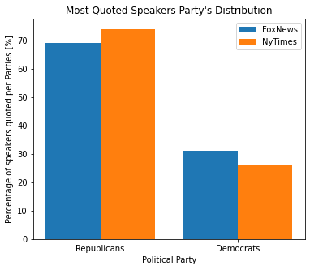
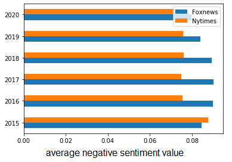
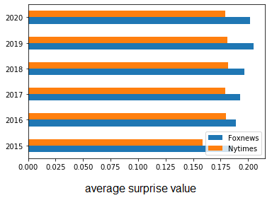

# Introduction

## Abstract

Donald Trump banned from twitter; this sentence should be familiar to you. In the last ten years, there has been an explosion of polemical phrases of all kinds. Most of the well-known newspapers have picked up these quotations and put them in their columns, and not only from Twitter... Thanks to the framework *Quobert*, developed by Robert West and others, we have a dataset of millions of quotations on hand coming from different newspapers between 2015 to 2020. The <b> million-dollar </b> question was the next one, what can we proceed with such a dataset?

To point out some interesting facts about these quotations, we have decided that we are going to focus on three main reading axes. Before doing this, the key step is <b> to read the entire dataset </b>. Once this has been done, we can then <b> much easily play with our data </b> ! Then, we decided to make <b> comparisons </b> between newspapers affiliated with <b> Democrats or Republicans </b>, and to see if there is an affiliation between the quotations reported in the newspapers and their political positioning. Since there are plenty of different newspaper, we decided <b> to focus initially on only two newspapers </b>, whose political views are well known. For doing comparisons between two newspapers, the objective is to analyze which <b> parameters </b> allow to make a difference between them. 

The three <b> parameters </b> we picked out are <b> topic detection, speakers, and sentiment analysis </b>. Once we analyze the quotations of two newspapers with those guidelines, the next step is to apply the parameters which give a signifcant results to other journals. That in order to produce a clear framework that would allow to compare newspapers and state their political affiliation.

# Methods

## Choice of the two reference newspapers

First, the choice of the two newspapers we will work with is crucial. Some journals have “centered” opinions or shaded positioning. That is why, the focus will be made on polarized newspapers, which will make it easier to study and define the parameters. For our study, two newspaper have been chosen: Foxnews and New York Times. Both are polarized, Foxnews is in favor of more conservative political positions and is mainly viewed by Republican partisans while New York Times is more left-leaning and followed mainly by Democrats (figure below, [Statista, consulted the 15.11.2021](https://www.statista.com/chart/21328/party-affiliation-by-news-source/)). Note that the data showed that the New York Times had more quotations available in the Quotebank dataset than Fox news. The number of quotations found for the New York Times was of 894,838 quotes compared to 708,383 for Fox News.

## Wrangling and reading the dataset

Concerning the reading of the data, our first approach was to read the dataset using chunks and then to generate a single pickle file from these chunks. The problem was that reading the chunks one after the other from the pickle file generated an extremely heavy file (the operation was stopped when the file size exceeded 150 Gigabytes!). 
Consequently, an alternative was proposed : the approach was to use only one chunk per pickle by reading the files of each year and combining them together. Then, we were able to generate a dataframe for each newspaper we were interested in, which whole quotations between 2015 and 2020.  

# Topic Detection

## Number of topics for each journal

Latent Dirichlet Allocation (LDA) is an unsupervised method which allow to create magically topics composed of specific words.
One has to specify the number of topics. To do so, the ideal number of topics for the newspaper has to be specified. We calculated the coherence score for different number of topics (from 2 to 10), the plots show the results. Then we have taken the number which corresponds to the highest score and we have plot the topics using PyLDAvis.

<body> 

 
<h3> Determination of the number of topics for the <b> New York Times </b> </h3>
   

   
 
</body> 

  

<body> 

 
<h3> Determination of the number of topics for <b> Fox News </b> </h3>
   

   
 
</body> 

  

Some observations can be made :
<ul>
  <li>The Coherence C_V predicts 3 topics for the New York Times and 9 topics for Fox news.</li>
<li> Whereas for Fox News, an increasing tendency is noticed, for New York times, the optimal number of topics is low and equals 3. One could think that Fox News speaks more about different subjects. But another analysis would be that actually New York times treats more about various subjects so it is hard to put them into several topics as there is a lot of them and it is hard to separate the words into clear topics.
 </li>
</ul>

## Visualisation of the number of topics

<body> 

 
<h3> Topic Detection for the New York Times </h3>
   

   
 
</body> 

<iframe src="static/LDAvis_prepared_NY_3topics.html" style="width: 1200px; height: 700px; border: 0px"></iframe>

<body> 

 
<h3> Topic Detection for the Fox News </h3>
   

   
 
</body> 

<iframe src="static/LDAvis_prepared_Fox_9topics.html" style="width: 1200px; height: 700px; border: 0px"></iframe>

From now on, as shown in the two graphs, we will focus exclusively on 3 themes for New York Times and 9 for Fox News and proceed to an LDA.  

## Comparison between topics for the New York Times and Fox News

Looking at the Topic Detection by LDA for both newspapers, the following can be observed:
<ul>
  <li>For the New York Times, the most salient words without definiting a topic are related to democrat or neutral terms (i.g. Biden, Democrats, Hillary, impeachment,....) </li>
<li> Whereas for Fox News, the most salient words without definiting a topic are related to republican (expcept for the first one, Biden) or connotated words (border, anti, crime,...)
 </li>
</ul>

It's now your turn to play with the data with a click on the cycle you want to make appear the detected topics! With only a small coefficient of coherence, this result should be taken with caution (the C_V is only around 0.2 and 0.3).

# What can be said about the number behind the quotations ?

## Quotes counting

We all know that there are hot topics where republicans and democrats diverge. We selected some of them and we have associated words to each of them. The words were mapped to the same normalized form, by stripping affixes (words stemming) whenever possible. This allows to cover a higher range of quotations that could be related to the chosen topics of <b> immigration, terrorism, climate change, abortion, religion, racism </b>.
We first calculated how many quotations are about these specific topics. The results are illustrated in bar chart below.
Fox News has in general more quotations about the selected topic. This behavior is observed for all topics, except for climate change where their normalized occurrences re similar (as shown in the plot). The largest difference is for abortion, where Fox News has much more quotations. Religion is also more occurring for the latter and could make a clear link with a Republican affiliation. 
 

<body> 

 
<h3> Percentage of quotations by topic and newspapers </h3>
   

   
 
</body> 

  

Additionally, the t-test for each subject only gives a p-value higher than the significance level of 0.05 for climate change and thus shows that it is statistically equally cited by both newspapers. 

<table style="width:100%">
  <tr>
    <th></th>
    <th>p-value</th>
  </tr>
  <tr>
    <td>Immigration</td>
    <td>0.000000e+00</td>
  </tr>
  <tr>
    <td>Terrorism</td>
    <td>0.000000e+00</td>
  </tr>  
  <tr>
  <td>Climate change</td>
  <td>2.331170e-01</td>
</tr>
<tr>
  <td>Abortion</td>
  <td>4.609667e-67</td>
</tr>
   
<tr>
<td>Religion</td>
<td>0.000000e+00</td>
</tr>
   
<tr>
 <td>Racism</td>
 <td>8.309947e-51</td>
</tr>
   
<caption>Key parameters p-value for both newspapers
</caption>

</table>

It seems here once again, that Fox News prefers to talk more about those topics that the New York Times, which consolidates the hypothesis elaborated in the topic detection section of this data story. Here, this could be maybe explained by the fact that the New York Times has other priorities than this sensitive themes. 

## Year analysis

Then, we took another direction, and we plotted the topic related quotations for each journal by year. The results are shown in the plot below.  
As before, one can see that except for climate change, Fox News quotes more the chosen topics. Furthermore, even if the peaks for Fox News are higher than the ones from New York Times, it can be noticed that the peaks coincide. This means that probably an important event happened at that time and both newspapers wrote about it.  
The increase in Fox News quotations about immigration seem to happen during the period where Donald Trump was president and decided to construct the wall between the US and Mexico, with a decrease in 2019 when Biden took the presidency. The peak of quotes for abortion in 2019 is maybe due to the House Bill 314 and the Alabama abortion ban that happened on May 15, 2019, which imposed a near-total ban on abortion in the state starting in November 2019. Moreover, the peaks are usually much higher for Fox News compared to NYT, for example when looking at immigration or abortion graphs. Another evidence shown by these plots is that the differences in quotations talking about terrorism and religion between both media are one of the greatest and are almost constant.

<body> 

 
<h3> Key words over years for the New York Times and Fox News </h3>
   

   
 
</body> 

  

As a second part of this analysis, we focused on the speakers: 
<body> 

 
<h3> Most cited politicians </h3>
   

   
 
</body> 

  

This plot shows the most cited politicians for both newspapers and shows that Donald Trump is by far the most quoted one, since his histogram bean is still higher than the others, even with a logarithmic scale. 
 

### Republicans or Democrats speakers ?

Knowing the political affiliation of each, we tried to see if the New York Times would cite in the top 10 more Democrats while Fox News more Republicans. But in reality, NYT have more Republicans in its top 10 speakers while Fox News has more Democrats. This can be showed with the plot below :

<body> 

 
<h3> Political party's distribution </h3>
   

   
 
</body> 

  

Similarly, to the previous part, an analysis by year for some key politicians for each journal has been made. The increase in quotations about Biden are easy to explain since he became a candidate for the elections. For Hilary, Fox News seem to follow the elections, its quotations from Hilary are increasing until the 2016 elections, then going downs as Hilary has failed and then comes up again with the 2019 elections. On the opposite, NYT quotes Hilary increasingly since 2015. The number of quotes seem very much correlated to punctual events during the years especially for Fox News, the latter also seem to be more extreme and to always cite more the politicians in comparison to NYT. 

PLOT DES ANNEES

In the following part, a further depth into the data is carried out to understand the sentiment behind the respective quotations by each newspaper. 

# Sentiment analysis

The sentiment analysis between the two journals has been done thanks to two libraries: NLTK and text2emotion. For the first one the function “SentimentIntensityAnalyzer” has been use, it helps determined if the sentiments of a text are positive or negative. On the other hand, text2emotion capture the intensity of these 5 emotions: fear, happiness, anger, surprise and sadness.  
The dataset has been analysed in two forms: all the quotes by the NY times and Foxnews year by year, and the quotes from these two journals on certain subjects.

## Year by year analysis:

This analysis showed some consistency as each year (except for 2015), the quotes from Foxnews were more negative than the one from the NYtimes (for instance, in 2016, we got a p-value of 1.753e-125 ) as showed by the bar plot below.  

<body> 

 
   <h3> Comparison of <b> negative average sentiments score </b> between Foxnews and the NY times year by year with NLTK </h3>
   

   
 
</body> 

  

For the emotions, text2emotion function found that the quotations from Foxnews had more surprise and sadness than those from the New York Times (the two bar plots below illustrate this tendence). The fear emotion is about equal for all years between the two journals except for 2015 and 2020 where the quotes from Foxnews have more of this emotion.

<body> 

 
   <h3> Comparison of the <b> surprise and emotion average score year by year </b> between Foxnews and the NY times with text2emotion </h3>
   

   
 
</body> 

  

<body> 

 
   <h3> Comparison of the <b> average sadness score year by year </b> between Foxnews and the NY times with text2emotion </h3>
   

   
 
</body> 

  

## By subject analysis:

As said before, six subjects were analysed. The ones that showed the most differences between the two newspapers are immigration, terrorism, and racism, looking at positive and negative sentiment values from NLTK. The key parameters surprise, fear and sadness had also low p-values when comparing the distribution of the values for the two journals (for instance, for the surprise emotion on the racism subject, we got a p-value of 1.712e-14).  
For the subject climate change, Foxnews was a lot more negative (p-value of 1.813e-08) than the New York Times. For abortion and religion did not show big differences. What can be noted is the impact of the subject on the values of the emotions.

<body> 

 
   <h3> Comparison of the <b> surprise average score </b> by subject between Foxnews and the NY times with text2emotion </h3>
   

   
 
</body> 

  

<body> 

 
   <h3> Comparison of <b> positive and negative </b> sentiments about <b> climate change </b> between Foxnews and the NY times with NLTK </h3>
   

   
 
</body> 

  

## Sentiment analysis about the covid 

Citations mentioning covid are much more cited by Fox News compared to NYT. Indeed, between 2019 and 2020, approximately 5.3% of quotations were about corona while for NYT it was only of 2.2%. When digging a bit deeper, we can see that covid related quotations for both medias are expressing a lot of fear, followed by sadness, a bit of anger and some happiness for both journals which is at first glance weird, but don’t forget that some have found teleworking appealing and grounding. The only significant difference in terms of emotion when looking at the p-value is for surprise, where Fox News has a higher score.

<body> 

 
   <h3> Sentiment analysis related to Covid </h3>
   

   
 
</body> 

  

## Washington Post

The last step of the sentiment analysis is to try to replicate the findings on another journal, here the Washington Post we know that it’s left oriented ([Washington Post](https://www.allsides.com/news-source/washington-post-media-bias) ). Of all the differences found before, two of the tests on this third media company are presented here: the NLTK negative sentiment year by year calculation, and the text2emotion by subject. The first one (first plot below) seems to be inconclusive: it was expected that the Washington Post would be closer to the NY times than Foxnews, but that is not the case here. This could be explained by the fact that each newspaper has its own way of writing and therefore each newspaper is unique and not comparable.  
On the other hand, the second test (second plot below) seems to be more robust and closer to what we expected. In fact, the immigration, terrorism and racism subjects from the Washington Post are closer to the New York Times than for Fox News. Note that in the first part of the sentiment analysis, these subjects had also the biggest differences between the two initial journals.

<body> 

 
<h3> Comparison year by of positive and negative average score sentiments between Foxnews, the NY times and the Washington Post with NLTK </h3>
   

   
 
</body> 

  

<body> 

 
<h3> Comparison by subjects of the surprise average score sentiments between Foxnews, the NY times and the Washington Post with NLTK </h3>
   

   
 
</body> 

  

# Conclusion

Bla Bla Blaouououo

<b> Mettler Marc, Goulart Maia Manuela, M'Saada Sinda, Charroin François </b>
 
ADA, EPFL, December 2021
 
<a href="https://github.com/epfl-ada/ada-2021-project-therealabracadabra"><b>GitHub Repository</b></a>
•
<a href="https://github.com/mmettler21/political_analysis"> <b> Website Repository </b> </a>
 
<b>Theme </b>
<a href="https://github.com/chibicode/duo">duo</a>
<b>by </b>
<a href="https://github.com/chibicode">Shu Uesugi</a>
Title image 
<a href="https://github.com/chibicode/duo">duo</a>
 
Title image : [Pew Research Center, consulted the 17.12.2021](https://www.pewresearch.org/fact-tank/2021/11/22/both-republicans-and-democrats-prioritize-family-but-they-differ-over-other-sources-of-meaning-in-life/)

<a href="https://github.com/epfl-ada/ada-2021-project-therealabracadabra" class="github-corner"><svg width="80" height="80" viewBox="0 0 250 250" style="fill:#151513; color:#fff; position: absolute; top: 0; border: 0; right: 0;">
        <path d="M0,0 L115,115 L130,115 L142,142 L250,250 L250,0 Z"></path>
        <path d="M128.3,109.0 C113.8,99.7 119.0,89.6 119.0,89.6 C122.0,82.7 120.5,78.6 120.5,78.6 C119.2,72.0 123.4,76.3 123.4,76.3 C127.3,80.9 125.5,87.3 125.5,87.3 C122.9,97.6 130.6,101.9 134.4,103.2" fill="currentColor"
            style="transform-origin: 130px 106px;" class="octo-arm"></path>
        <path
            d="M115.0,115.0 C114.9,115.1 118.7,116.5 119.8,115.4 L133.7,101.6 C136.9,99.2 139.9,98.4 142.2,98.6 C133.8,88.0 127.5,74.4 143.8,58.0 C148.5,53.4 154.0,51.2 159.7,51.0 C160.3,49.4 163.2,43.6 171.4,40.1 C171.4,40.1 176.1,42.5 178.8,56.2 C183.1,58.6 187.2,61.8 190.9,65.4 C194.5,69.0 197.7,73.2 200.1,77.6 C213.8,80.2 216.3,84.9 216.3,84.9 C212.7,93.1 206.9,96.0 205.4,96.6 C205.1,102.4 203.0,107.8 198.3,112.5 C181.9,128.9 168.3,122.5 157.7,114.1 C157.9,116.9 156.7,120.9 152.7,124.9 L141.0,136.5 C139.8,137.7 141.6,141.9 141.8,141.8 Z"
            fill="currentColor" class="octo-body"></path>
    </svg></a>

