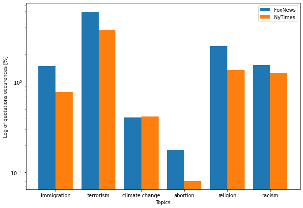

# Introduction

## Abstract

Donald Trump banned from twitter; this sentence should be familiar to you. In the last ten years, there has been an explosion of polemical phrases of all kinds. Most of the well-known newspapers have picked up these quotations and put them in their columns, and not only from Twitter... Thanks to the framework *Quobert*, developed by Robert West and others, we have a dataset of millions of quotations on hand coming from different newspapers between 2015 to 2020. The <b> million-dollar </b> question was the next one, what can we proceed with such a dataset?

To point out some interesting facts about these quotations, we have decided that we are going to focus on three main reading axes. Before doing this, the key step is <b> to read the entire dataset </b>. Once this has been done, we can then <b> much easily play with our data </b> ! Then, we decided to make <b> comparisons </b> between newspapers affiliated with <b> Democrats or Republicans </b>, and to see if there is an affiliation between the quotations reported in the newspapers and their political positioning. Since there are plenty of different newspaper, we decided <b> to focus initially on only two newspapers </b>, whose political views are well known. For doing comparisons between two newspapers, the objective is to analyze which <b> parameters </b> allow to make a difference between them. 

The three <b> parameters </b> we picked out are <b> topic detection, speakers, and sentiment analysis </b>. Once we analyze the quotations of two newspapers with those guidelines, the next step is apply the parameters whose give a signifcant results to other journals. That in order to produce a clear framework that would allow to compare newspapers and state their political affiliation.

# Methods

## Choice of the two reference newspapers

First, the choice of the two newspapers we will work with is crucial. Some journals have “centered” opinions or shaded positioning. That is why, the focus will be made on polarized newspapers, which will make it easier to study and define the parameters. For our study, two newspaper have been chosen: Foxnews and New York Times. Both are polarized, Foxnews is in favor of more conservative political positions and is mainly viewed by Republican partisans while New York Times is more left-leaning and followed mainly by Democrats (figure below, [Statista, consulted the 15.11.2021](https://www.statista.com/chart/21328/party-affiliation-by-news-source/)).

## Wrangling and reading the dataset

Concerning the reading of the data, our first approach was to read the dataset using chunks and then to generate a single pickle file from these chunks. The problem was that reading the chunks one after the other from the pickle file generated an extremely heavy file (the operation was stopped when the file size exceeded 150 Gigabytes!). 
Consequently, an alternative was proposed : the approach was to use only one chunk per pickle by reading the files of each year and combining them together. Then, we were able to generate a dataframe for each newspaper we were interested in, which whole quotations between 2015 and 2020.  

# What can be said about the number behind the quotations ?

## BLABLABLA

We selected some words that we thought they can differentiate democrats and republicans and we analyze their frequency of apparencies in the Quotebank. We notice that even though the number of quotations from the New York Times in the Quotebank dataset is larger than the one from Fox News <b> (mettre NUMBER !!!!!!!!!!!!!) </b>, the later has more quotations about those topics than the other one, except for climate change where their occurrences are similar. From this we can maybe elaborate a first hypothesis that Fox News gives a higher importance to sensitive topics. 

<body> 

 
<h3> Word normalization by stemming </h3>
   

   
 
</body> 

  

A t-test was done to search for a correlation between our results and as expected, only the p-value of topics related to climate change was higher than 0.05 <b> (ALPHA !!!!!!!!!!!!!) </b> and thus their means are comparable. This could be maybe explained by the fact that the New York Times has other priorities. 

<body> 

 
<h3> Word normalization by stemming </h3>
   

   
 
</body> 

  

# Table example

<table style="width:100%">
  <tr>
    <th>Social Network</th>
    <th>Data</th>
  </tr>
  <tr>
    <td>Twitter</td>
    <td>3 millions of tweets from 4k users</td>
  </tr>
  <tr>
    <td>Stack Overflow</td>
    <td>1 million of comments from 22k of users</td>
  </tr>
  <tr>
    <td>Weibo</td>
    <td>40k posts from 431 users </td>
  </tr>
  <tr>
    <td>Reddit</td>
    <td>272k comments from french subreddit</td>
  </tr>
</table>

# HTML example

<html> 
  <head> 
     
     
  </head> 

  <body> 
  
 
  <h3> Comparison between the distribution of posts during the day across our platforms </h3>
     

     
 
  </body> 
</html>

# Retour à la ligne, exemple

Based on the graphs, some observations can be made:
<ul>
  <li><b>Usage drops across all platforms at night</b>, and increases in the morning.</li>
  <li>While for <b>Twitter and Weibo</b>, usage continues to increase during the day and lowers at night, starting at around 9pm, the trend seems to differ for Reddit and Stack Overflow. For these platforms, <b>the activity drops earlier</b>, at around 2pm for Reddit and 3pm for Stack Overflow.</li>
  <li>Stack Overflow is a work-oriented platform, these observations are in line with the usage we expect. The <b>users are mainly active during work hours (9pm-5am)</b>. We can even see little drops at lunch time. </li>
  <li>The same remark as the previous one can be made about Reddit even if it can be surprising considering that it is a social network that contains all kinds of contents. </li>
</ul>

# Table 2, example

<table style="width:100%">
<caption>Distribution of the posts/hour disregarding the day of the week
</caption>
  <tr>
    <th></th>
    <th>00-06am</th>
    <th>06-12am</th>
    <th>12am-06pm</th>
    <th>06-12pm</th>
  </tr>
  <tr>
    <td>Twitter</td>
    <td>15.2%</td>
    <td>19.2%</td>
    <td>28.3%</td>
    <td>37.3%</td>
  </tr>
  <tr>
    <td>Stack Overflow</td>
    <td>7.5%</td>
    <td>29.7%</td>
    <td>40.7%</td>
    <td>22.1%</td>
  </tr>  
  <tr>
  <td>Weibo</td>
  <td>9.3%</td>
  <td>23.1%</td>
  <td>32.2%</td>
  <td>35.4%</td>
</tr>
<tr>
  <td>Reddit</td>
  <td>6.7%</td>
  <td>28.9%</td>
  <td>39.5%</td>
  <td>24.9%</td>
</tr>

</table>

# HTML, Example 2

After having studied the activity related to the posts and comments, let's dive into the users' activity.

<html> 
  <head> 
     
     
  </head> 

  <body> 
  
 
  <h3> Comparison between the distribution of active users during the day across our platforms </h3>
     

     
 
  </body> 
</html>

The distribution of active users by time of day and day of the week <b>does not differ dramatically to the posts</b>. We can still note a few interesting observations. For Twitter the number of active users <b>does not increase as fast as the number of tweets during the day</b>. It seems that people tend to tweet more at the end of the day. For Stack OverFlow,<b> the peaks in number of comments correspond to the peak in active users</b>. Finally for Weibo, trends are very similar across both of the distributions.

# Conclusion

Bla Bla Bla

 
<footer style="background-color: #d32f2f">
    

        

            

                

                     
                    Mettler Marc, Gulart Maia Manuela, Msaada Sinda, Charroin François
                     
                    <button id="ada"><b>ADA</b></button>, EPFL, December 2021
                     
                    <a href="https://github.com/epfl-ada/ada-2021-project-therealabracadabra"><b>GitHub Repository</b></a>
                    •
                    <a href="https://github.com/mmettler21/political_analysis"> <b> Website Repository </b> </a>
                     
                    <b>Theme </b>
                    <a href="https://github.com/chibicode/duo">duo</a>
                    <b>by </b>
                    <a href="https://github.com/chibicode">Shu Uesugi</a>
                     
                

            

        

    

</footer>

